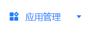
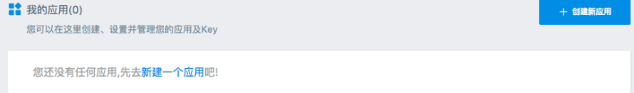
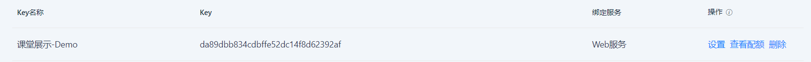
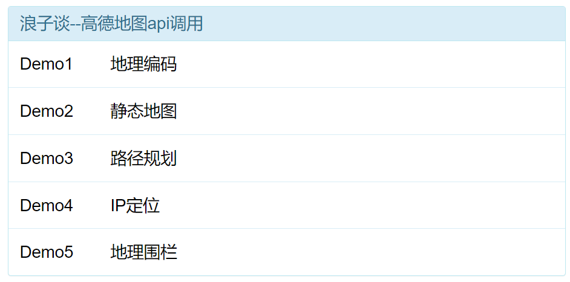
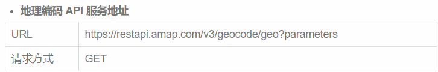
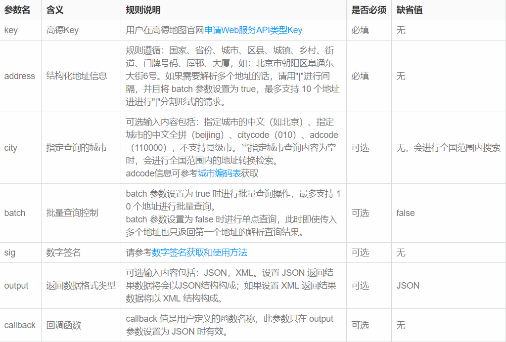
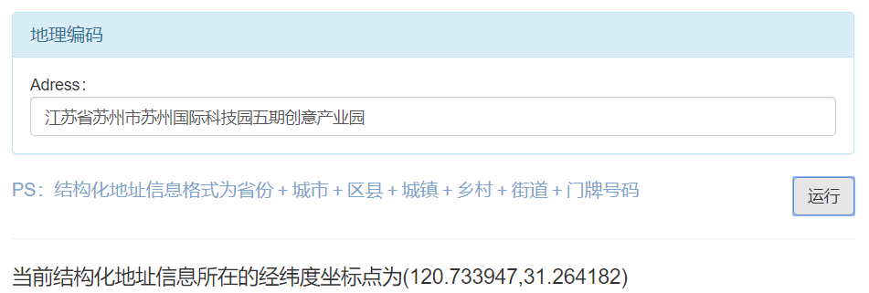
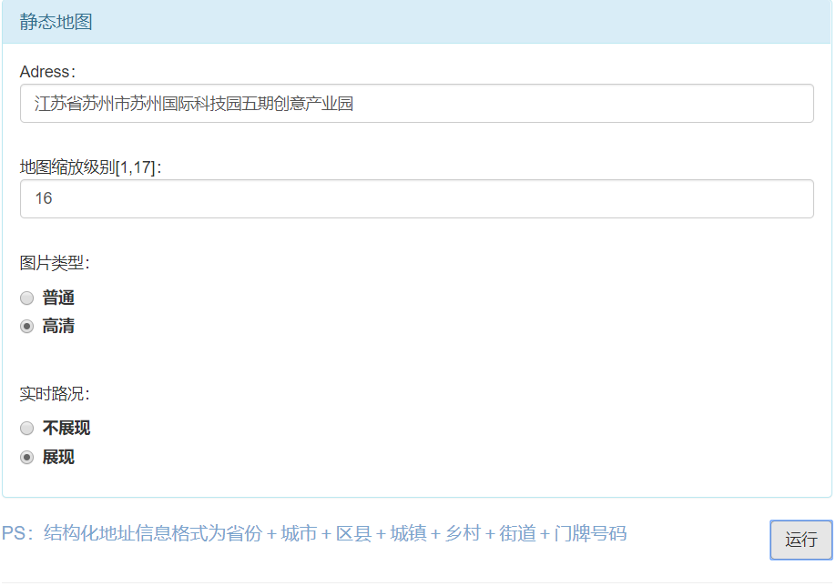
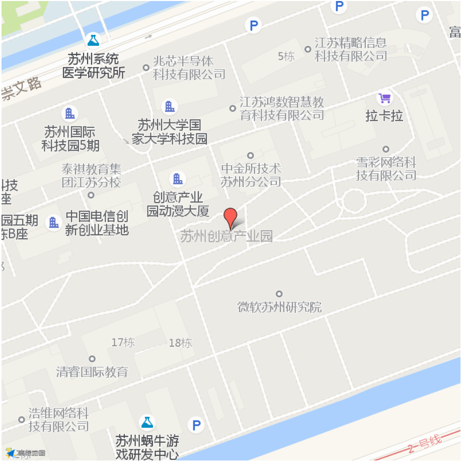

[TOC]


##  1.地图应用

地图应用是为用户提供包括智能路线规划、智能导航（驾车、步行、骑行）、实时路况等出行相关服务的平台。这些应用通过对地理位置的定位及一系列运算操作提供各类地图服务，极大的方便了人们的生活。

定位指确定某个元素的方位（经纬度坐标），目前的定位方式大致分为以下三种：

#### 1.1 GPS定位

不需要sim卡，不需要连接网络，只要在户外，基本上就能随时随地的准确定位。但是GPS启动后搜索卫星的时间比较多，一般需要2分钟左右。

优势：定位精度高，只要能接收到四颗卫星的定位信号，就可以进行误差在5米以内的定位。

缺点：GPS受天气和位置的影响较大。

#### 1.2 LBS（基站）定位

基站定位是通过移动通信的基站信号差异来计算出手机所在的位置，取决于定位地点附近所处的基站覆盖密度，定位精度一般在50-2000米。必须联网，手机处于sim卡注册状态（飞行模式下开wifi和拔出sim卡都不行）。

优点：方便，因为它是通过SIM卡接收基站信号进行定位的。理论上说，只要计算三个基站的信号差异，就可以判断出手机所在的位置。因此，只要用户手机处于移动通信网络的有效范围之内，就可以随时进行位置定位，而不受天气、高楼、位置等等的影响。

缺点：定位精度稍逊于GPS，使用范围窄（依赖基站）,不太适合野外使用。

#### 1.3 WIFI定位

WiFi定位的目的是解决室内精确定位，原理类似基站定位。 

优点：①定位精度高，wifi密集人流多的地方相当精确；②速度快；③周围的wifi即使连接不上也能定位。

缺点：显而易见的，①wifi依赖！——没有打开wifi就不能定位；②必须处于联网状态。

Of course，对于诸位个人开发者而言，独立开发一个地图是不现实的（除非你牛逼到能发射卫星），然而在我们的软件开发过程中经常会用到某些关于地图的功能，这时我们可以调用地图应用在开放平台上为开发者提供的接口来满足这些功能需求（用别人家的卫星），下面以高德地图为例来阐述。

## 2.高德地图使用步骤

#### 2.1 注册登录高德开放平台  https://lbs.amap.com/

#### 2.2 点击右上角控制台进入应用管理

​                                                                   

#### 2.3 创建新应用



#### 2.4 为你的应用添加key

名词解释：key为秘钥，只有拥有一个合法的key才有资格调用高德地图的接口

申请成功后，我们就拥有了一个key串



此时可以调用高德地图各个功能，下面以web端为例展示各接口的用法


## 3.高德地图api详解

官方文档url：[https://lbs.amap.com/api/webservice/summary](https://lbs.amap.com/api/webservice/summary)

演示Demo：



#### 3.1 地理/逆地理编码

高德地图提供了结构化地址与经纬度之间相互转化的能力

通常情况下，用户给出一个结构化地址，在软件进行运算操作(如距离测算)之前，须将结构化地址转化为经纬度。而对于返回给用户的结果，需要把参与运算的经纬度转换成用户能够理解的结构化地址。





example：



在这个实例中，我们采用ajax向高德服务器发送请求

```js
var xmlHttp;
xmlHttp=new XMLHttpRequest();
xmlHttp.onreadystatechange=function()//异步请求，在没有得到服务器响应之前，代码继续向下运行
{
    if (xmlHttp.readyState==4 && xmlHttp.status==200)
    {
        //解析json并将解析出的值传入html
        var obj = eval('(' + xmlHttp.responseText+ ')');
        var temp = obj.geocodes;
        var obj2 = temp[0];
        var location=obj2.location;
        document.getElementById("myLocation").innerHTML=location;
    }
}
xmlHttp.open("GET","https://restapi.amap.com/v3/geocode/geo?address="+input_adress+"&key=da89dbb834cdbffe52dc14f8d62392af",true);
xmlHttp.send();  //发送请求
```

接口返回值可选json或xml，在这里我们选择json作为返回值的格式，并通过js自带的解析器将其中我们需要的信息解析出来，逆地理编码同理。

PS：地址编码是许多其他接口的基础，这些接口需要传入的经纬度坐标参数可通过地址编码获得。

##### 3.1.1 名词解释

JSON：json为一种轻量级数据交换格式，由键值对组成。前端调用时可通过json数组中的键获取值，从而达成后端数据在前端显示的目的。

Ajax：Ajax 即“Asynchronous Javascript And XML”，主要是实现页面和 web 服务器之间数据的[异步传输](https://www.baidu.com/s?wd=异步传输&tn=SE_PcZhidaonwhc_ngpagmjz&rsv_dl=gh_pc_zhidao)。可以在无需加载整个网页的情况下更新网页，效率高，用户体验性好。

##### 3.1.2 开发难点

嵌套json的解析方法：想要使用js成功解析一个复杂json，关键在于要弄清楚当前待操作的是一个数组还是一个对象，以下面的json为例：

```json
{"status":"1","info":"OK","infocode":"10000","count":"1","geocodes":[{"formatted_address":"北京市朝阳区阜通东大街|6号","country":"中国","province":"北京市","citycode":"010","city":"北京市","district":"朝阳区","township":[],"neighborhood":{"name":[],"type":[]},"building":{"name":[],"type":[]},"adcode":"110105","street":"阜通东大街","number":"6号","location":"116.483038,39.990633","level":"门牌号"}]}
```

对于这个json，我们要提取其中的location，即经纬度坐标。首先，应先在最外层增加一个大括号，使其成为合法的对象，此时可以调用该对象中的geocodes属性这时，我们应注意到在geocodes中最外层是中括号，证明它是一个数组，要按照访问数组的方式去访问。如果数组内的元素还是对象或数组，则继续通过调用属性或访问下标的方式处理它，直至得到我们想要的数据，参考代码见上上图。

#### 3.2 静态地图

开发者可根据自身需求将静态地图内嵌到自己的网页中

调用高德地图相应接口获取经纬度区域静态地图，可设置中心点，返回图片大小等参数

[大圆球了解一下](https://restapi.amap.com/v3/staticmap?location=120.729000,31.262500&zoom=16&size=750*300&markers=large,,%E7%90%83:120.729000,31.262500&key=da89dbb834cdbffe52dc14f8d62392af&traffic=1&scale=2)

example：





根据自身需求去调整各个参数，url与参数列表如下：


##### 3.2.1 开发难点

如何将地图返回至html？

我们通过ajax操作对高德服务器访问，服务器会返回给我们一个地图，而将这个地图传给html并显示非常困难。

解决方案：当我们在js中获取到各个参数并拼接成字符串后，并不通过ajax访问服务器，而是将这个字符串传给html中img的src标签，通过src属性对图片的加载直接在前端显示图片，具体代码如下。

```javascript
var src="https://restapi.amap.com/v3/staticmap?location="+location+"&zoom="+level+"&size=400*400&markers=large,,:"+location+"&key=da89dbb834cdbffe52dc14f8d62392af&traffic="+traffic+"&scale="+scale;
document.getElementById('image').src = src;
```

```html
<hr>
<image id="image" src="../img/mlxg.png" width="100%"></image>
<hr>
```

##### 3.2.2 拓展延伸

通过该接口，如何获得动态地图？

#### 3.3 路径规划

帮助规划出行路线，给出出发点，终止点和交通方式，就能替你寻找到比较适合的路线。

for example：


PS：在同一策略下，服务器可能会返回多条推荐路线。为演示方便起见，我们在进行json解析时只解析出一条推荐路线，不代表服务器只返回一条路线。

篇幅所限，部分url与参数列表如下：


##### 3.3.1 开发难点

1.若选择公交出行，存在一个city参数为必选参数，我们需要在结构化地址信息中将城市名字提取出来，操作代码如下：

```javascript
var s1=start_adress.indexOf("省");
var s2=end_adress.indexOf("省");
//防止某地名中带有“省”字
if(s1>3)
    s1=-1;
if(s2>3)
    s2=-1;
var t1=start_adress.indexOf("市");
var t2=end_adress.indexOf("市");
var city1=start_adress.substring(s1+1,t1);
var city2=end_adress.substring(s2+1,t2);
```

在上述代码中，即使没有出现省份信息（直辖市），substring从零开始切割，不影响城市名字的提取。

2.html中显示信息会根据用户选择的不同出行方式自动改变，我们使用hidden来完成这一需求，通过给hidden赋予不同的值，使html元素块显示或隐藏，代码如下：

```html
<label class="radio">
    <input type="radio" name="travel_type" value="1" onclick="fun('1')"/>步行
</label>
<label class="radio">
    <input type="radio" name="travel_type" value="2" onclick="fun('2')" />公交
</label>
<label class="radio">
    <input type="radio" name="travel_type" value="3" onclick="fun('3')" />驾车
</label>

<div id="strategy2" hidden>
<div id="strategy3" hidden>
```

```javascript
function fun(index) {
    if(index==1)
    {
        document.getElementById("strategy2").setAttribute("hidden","hidden");
        document.getElementById("strategy3").setAttribute("hidden","hidden");
        document.getElementById("result").innerHTML="";
    }
    if(index==2)
    {
        document.getElementById("strategy3").setAttribute("hidden","hidden");
        document.getElementById("strategy2").removeAttribute("hidden");
        document.getElementById("result").innerHTML="";
    }
    if(index==3)
    {
        document.getElementById("strategy2").setAttribute("hidden","hidden");
        document.getElementById("strategy3").removeAttribute("hidden");
        document.getElementById("result").innerHTML="";
    }
}
```

##### 3.3.2 拓展延伸

对于某些不符合常理的要求，应当捕捉这个异常并抛出，将异常信息返回给用户。

比如选择步行的出行方式从黑龙江去苏州，很明显不应该铁憨憨的返回给用户路线规划，而应该抛出异常信息：

“没钱坐车就老实呆着”。

对于高德地图而言，对于大于阈值的距离若选择步行，服务器会返回异常json包，解析后根据返回的错误代码将错误抛给用户即可。

#### 3.4 IP定位

IP定位是一个简单的HTTP接口，根据用户输入的IP地址，能够快速的帮用户定位IP的所在位置。

for example:


url与参数列表如下：


PS：ip查询在生活中有着广泛的用途，如广告推荐，天气查询（地区变更天气更新）等。

##### 3.4.1 直辖市与局域网的处理

```javascript
var input_ip = document.getElementById("input_ip").value;
var xmlHttp;
xmlHttp = new XMLHttpRequest();
xmlHttp.onreadystatechange = function ()//异步请求，在没有得到服务器响应之前，代码继续向下运行
{
    if (xmlHttp.readyState == 4 && xmlHttp.status == 200) {
        //解析json并将解析出的值传入html
        var obj = eval('(' + xmlHttp.responseText + ')');
        var location = obj.province+obj.city;
        if(obj.province==obj.city)//直辖市或局域网
            location =obj.city;
        document.getElementById("myLocation").innerHTML = location;
    }
}
if (input_ip=="")//若输入为空，则定位http请求发送的位置
    xmlHttp.open("GET", "https://restapi.amap.com/v3/ip?key=da89dbb834cdbffe52dc14f8d62392af", true);
else
    xmlHttp.open("GET", "https://restapi.amap.com/v3/ip?key=da89dbb834cdbffe52dc14f8d62392af&ip="+input_ip, true);
xmlHttp.send();  //发送请求
```

直辖市和局域网返回的province和city值是相同的，当检测到这种情况时，只需输出其中一个即可。

在javascript中，可直接用“==”判断字符串相等。

##### 3.4.2 定位https请求发送的位置

当检测到html传入js的字符串为空串时，访问的url缺省ip参数，即可定位https请求发送的位置，代码见上图。

#### 3.5 地理围栏

地理围栏服务是一类HTTP接口，提供在服务端，增删改查地理围栏的功能，同时支持对于设备与围栏关系进行监控，下面以签到打卡类场景介绍地理围栏。

for example：


部分url与参数列表如下：


##### 3.5.1 踩坑分享

1.删除已创建的围栏时使用DELETE请求。是的你没看错，不是GET也不是POST，而是从来没有听说过的DELETE......也不知道他们是怎么搞出这种请求的，咱也不敢问。

```javascript
xmlHttp.open("DELETE", "https://restapi.amap.com/v4/geofence/meta?key=da89dbb834cdbffe52dc14f8d62392af&gid="+gid, true);
```

上文就是原生ajax的正确代码，然后他的api是这样写的：


说好的POST在body体中发送等价于上面那个看不懂的，结果用jQuery封装ajax访问的时候疯狂报未知错误，让我去联系开发平台工作人员,心态崩了......

反正请求方式就写个DELETE就行，为啥我也不知道。


2.jquery封装的ajax返回的res.data是对象类型，需转成字符串类型才能使用js解析json

```javascript
$.ajax({
    url: "https://restapi.amap.com/v4/geofence/meta?key=da89dbb834cdbffe52dc14f8d62392af",
    type: "post",
    dataType: "json",
    data: JSON.stringify({"name":"围栏Demo","center":center,"radius":radius,"repeat":"Mon,Tues,Wed,Thur,Fri,Sat,Sun"}),
    contentType:"json/application",
    success: function (res) {
        console.log(res.data);
        var obj = eval('(' + JSON.stringify(res.data) + ')');
        gid=obj.gid;
        alert("围栏创建成功！");
    }
})
```

PS：高德地图web端开发中没有给出定位用户准确位置的接口（可能因为PC端无GPS）

##### 3.5.2 拓展延伸

在上述样例中，我们将创建围栏后得到的gid存储在javascript中，删除围栏时使用，这种做法是不科学的。因为用户在创建围栏后并不会马上删除围栏，而js刷新后数据就丢失了。为解决这个问题，以及同时对多个围栏进行管理，我们应该采取何种方式？